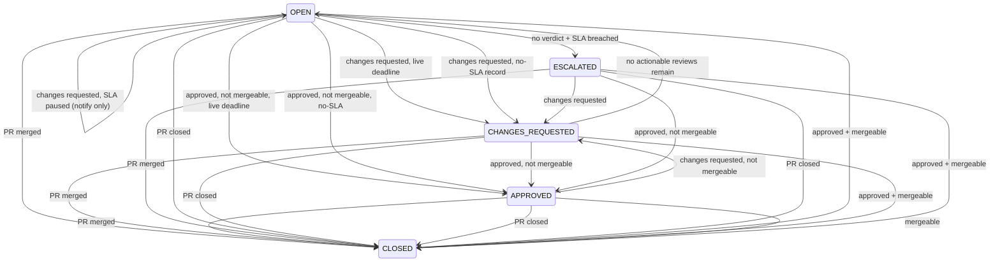

# PR lifecycle FSM (generated)

<!-- Generated from PrLifecycle.TRANSITIONS by MermaidRenderer — do not edit by hand. -->
<!-- Regenerate: make regen-fsm-diagram (from api/) -->

```mermaid
stateDiagram-v2
    OPEN --> CLOSED : PR merged
    CHANGES_REQUESTED --> CLOSED : PR merged
    APPROVED --> CLOSED : PR merged
    ESCALATED --> CLOSED : PR merged
    OPEN --> CLOSED : PR closed
    CHANGES_REQUESTED --> CLOSED : PR closed
    APPROVED --> CLOSED : PR closed
    ESCALATED --> CLOSED : PR closed
    OPEN --> CHANGES_REQUESTED : changes requested, live deadline
    OPEN --> CHANGES_REQUESTED : changes requested, no-SLA record
    OPEN --> OPEN : changes requested, SLA paused (notify only)
    OPEN --> CLOSED : approved + mergeable
    OPEN --> APPROVED : approved, not mergeable, live deadline
    OPEN --> APPROVED : approved, not mergeable, no-SLA
    OPEN --> ESCALATED : no verdict + SLA breached
    CHANGES_REQUESTED --> CLOSED : approved + mergeable
    CHANGES_REQUESTED --> APPROVED : approved, not mergeable
    CHANGES_REQUESTED --> OPEN : no actionable reviews remain
    APPROVED --> CLOSED : mergeable
    APPROVED --> CHANGES_REQUESTED : changes requested, not mergeable
    ESCALATED --> CLOSED : approved + mergeable
    ESCALATED --> APPROVED : approved, not mergeable
    ESCALATED --> CHANGES_REQUESTED : changes requested
```
