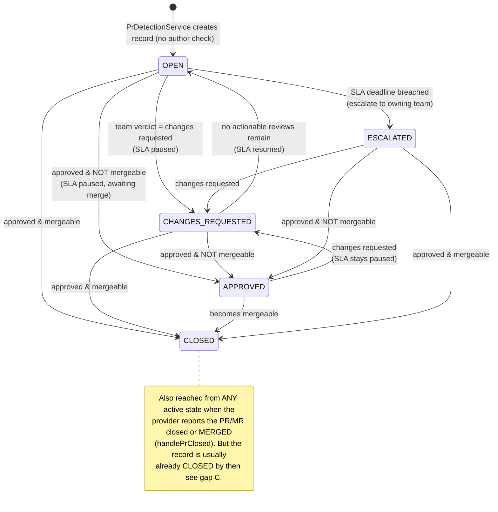
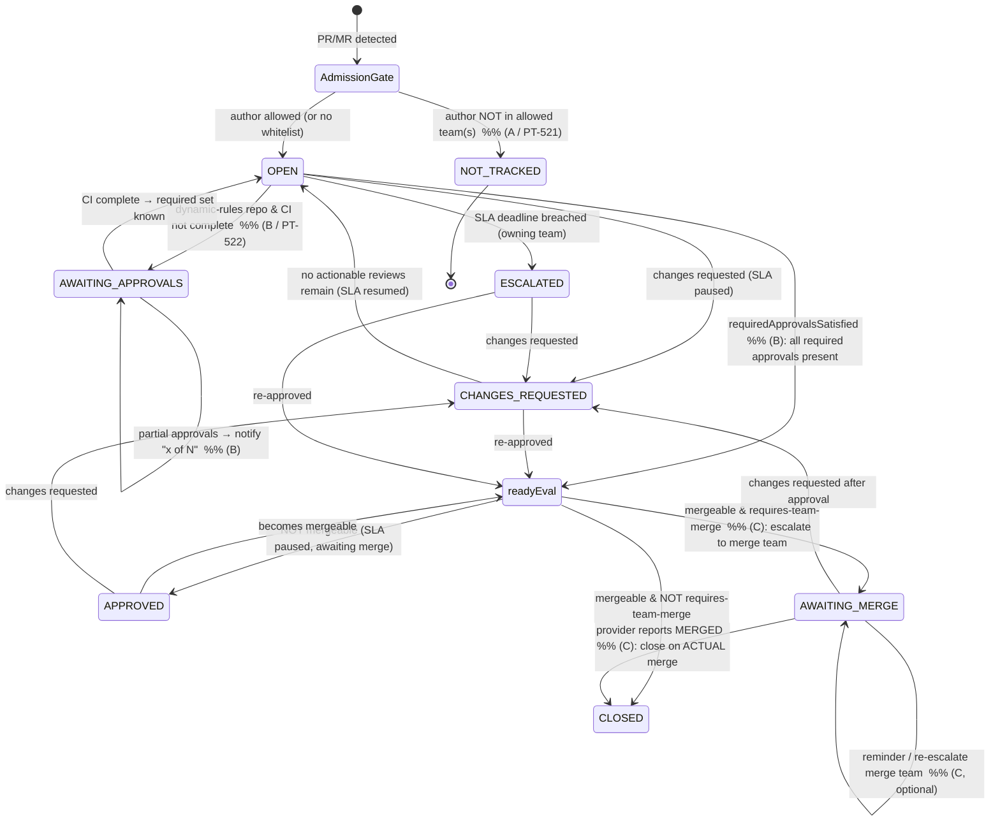

# Spike: PR/MR Tracking Enhancements

**Status:** Draft (spike) · **Date:** 2026-06-15 · **Epic:** [PT-437](https://cecg-force.atlassian.net/browse/PT-437) — Support Bot GitLab + Multi Support Room

Related tickets:
- [PT-521](https://cecg-force.atlassian.net/browse/PT-521) — PR Tracking: MR **author verification**
- [PT-522](https://cecg-force.atlassian.net/browse/PT-522) — PR Tracking: **Dynamic approval rules**
- **(new, to be raised)** — PR Tracking: **Escalate to required merge team** when the author cannot self-merge

This document captures a spike across three related enhancements to PR/MR lifecycle tracking. They are grouped because they share data-model prerequisites and all touch the same lifecycle state machine. The recommendation is to treat the shared groundwork as a single foundation, then layer the three features on top.

---

## 1. The three requirements

| # | Ticket | Requirement (short) | Where it bites |
|---|--------|---------------------|----------------|
| A | PT-521 | Only track PRs/MRs whose **author** belongs to a whitelisted team; ignore the rest. | Admission, *before* a tracking record is created. |
| B | PT-522 | Wait for **CI** to determine the **required** approvals, and only close once **all** required approvals are present (notify on partial). | The approval-evaluation guard inside the state machine. |
| C | new | Some repos require the merge to be performed by a **specific team** (CODEOWNERS / designated mergers), not the author. Keep SLA paused and **escalate to that team**; close only on the **actual merge**. | The closure step: *approved + mergeable* is no longer terminal. |

---

## 2. Current lifecycle (as built)

Source of truth: `PrLifecyclePoller` (`api/service/.../prtracking/PrLifecyclePoller.java`). Records are created by `PrDetectionService` in `OPEN`, then advanced on each poll (cron `0 0 9-18 * * 1-5`). Approval is reduced to a **single latest actionable team review** (`TeamReviewFilter.findLatestActionableReview`) — either `APPROVED` or `CHANGES_REQUESTED`. Mergeability is the tri-state `PrMetadata.isMergeable()`.

### Properties / assumptions baked in today

1. **No admission gate.** Every detected PR/MR is tracked regardless of author → *gap A (PT-521)*.
2. **Single-approval model.** The *latest* actionable team review wins; there is no notion of "N required approvals", and CI state is ignored when deciding approval → *gap B (PT-522)*. (`mergeable` deliberately ignores required-check state, by design.)
3. **`approved + mergeable` is terminal.** `handleApprovalClosure` sets `CLOSED` immediately — the bot never waits to observe the real merge, nor who performed it → *gap C (new)*. SLA is paused on approval but the bot then waits **silently**; nobody is nudged to actually merge.

---

## 3. Target lifecycle (covering A + B + C)

Three changes, each isolated to one seam:

- **A — admission gate (PT-521):** before creating a record, resolve the author's team membership and skip tracking if they're not in the configured allowed-author team(s). This is upstream of the state machine (`PrDetectionService`).
- **B — approval predicate (PT-522), GitLab-only:** replace "latest actionable review" with `requiredApprovalsSatisfied(pr)` = *CI complete* **AND** *every required approval rule satisfied*, read natively from GitLab's `approval_state` (`report_approver` rules, which reflect policy escalation). While CI is still running on a dynamic-rules repo, the required set is unknown → stay `OPEN`/`AWAITING_APPROVALS`. A captured-but-incomplete approval emits a "1 of N" notification without closing. Enabled only for repos that actually use **MR Approval Policies** (GitLab Ultimate Tier Subscription) — see decisions below. **GitHub parity is out of scope** for this feature.
- **C — merge-team gate (new):** when approvals are satisfied and the PR is mergeable **and** the repo is `requires-team-merge`, do **not** close. Enter `AWAITING_MERGE`, keep SLA paused, escalate to the merge team, and close only when the provider reports `MERGED`.

> Diagram intent: new/changed elements are annotated with the owning area (A/B/C). Everything not annotated is existing behaviour. `readyEval` is a decision point, not a persisted status.

### What changes, concretely

- **New persisted statuses:** `AWAITING_MERGE` (C), and optionally `AWAITING_APPROVALS` (B) — DB enum `pr_tracking_status` extension, mirroring the V13 migration that added `APPROVED`/`CHANGES_REQUESTED`.
- **New escalation reason:** merge-team escalation (C) is distinct from SLA-breach escalation — same `ESCALATED` plumbing (`EscalationProcessingService`) but a different target team and trigger (fires immediately on mergeable, not on SLA deadline).
- **Approval becomes a predicate** (B) rather than a single review lookup in `TeamReviewFilter`.
- **Closure waits for `MERGED`** on `requires-team-merge` repos (C) instead of `handleApprovalClosure` firing on `mergeable`.

---

## 4. Shared groundwork (do once, used by all three)

1. **Author identity on `PrMetadata`.** Today `PrMetadata` (and `GitHubPullRequest`) carry neither the author nor the merger. **A requires the author** (admission gate). **Merger identity is optional** — C closes on `MERGED` without checking who merged (see §7), so `merged_by`/`merge_user` is only worth capturing for richer "merged by X" messaging, not for any decision.
   - GitHub: author `user.login` (merger `merged_by.login` — optional).
   - GitLab: author `author.username` (merger `merge_user` — optional; `merged_by` is deprecated).
2. **Team/member resolution is reusable.** `TeamReviewFilter` → `resolveTeamMembers` already resolves GitHub team slugs and GitLab group paths (cached). A's allowed-author-team and C's merge-team can reuse it; only new **config** fields are needed.
3. **Config shape.** New per-repo fields, reusing the existing `github-team-slug` / `gitlab-group-path` reference style:
   - A: `allowed-author-teams` (list)
   - C: `requires-team-merge` (flag) + `merge-team` (reference)
   - B: `dynamic-approvals` (flag) — "wait for CI before deciding required approvals"

---

## 5. Per-provider API feasibility (spike findings)

Verdicts from official-doc research (GitHub `docs.github.com`, GitLab `docs.gitlab.com`).

| Capability | GitHub | GitLab |
|---|---|---|
| **Author identity** (A) | `pull.user.login` — REST ✅ | `merge_request.author.username` — REST ✅ |
| **Author team membership** (A) | `GET /orgs/{org}/teams/{slug}/memberships/{user}` — REST ✅ (`read:org`) | `GET /groups/{id}/members/all` (incl. inherited) — REST ✅ (`read_api`, Reporter on group) |
| **Merger identity** (C) | `merged_by.login` — REST ✅ | `merge_user` — REST ✅ (`merged_by` deprecated) |
| **"Author can't self-merge"** (C) | **No single field.** Infer from branch protection `restrictions` (push/merge allow-list, **org/Enterprise only**) + CODEOWNERS parsing. → prefer **config-declared**. | **No single flag.** Read `protected_branches.merge_access_levels` (role/user/group); user/group-specific entries are **EE/Premium**. → prefer **config-declared**. |
| **CI completion** (B) | Combined status + Checks API; required checks via branch protection `required_status_checks` — REST ✅ | `merge_request.head_pipeline.status` — REST ✅ |
| **Required-approval state** (B) | No native "N required approvals" object; `mergeable_state = blocked` is a coarse, undocumented signal. Required reviewers are path-based only. | `GET .../merge_requests/{iid}/approval_state` exposes `report_approver` rules with `approvals_required`/`approved` — REST ✅ (**EE/Premium**) |
| **Dynamic "scan fails → require security team"** (B) | **Not native.** GitHub has no check-result-conditional reviewer rule; the bot itself must be the gate (required status check). | **Native** via MR **Approval Policies** (scan-result) — **Ultimate Tier Subscription** only; readable via `approval_state` (`report_approver` rules reflect the escalation). |

### Key cross-provider takeaways

- **A** is clean REST on both — lowest risk, smallest surface.
- **C**'s "can the author merge?" is **not reliably queryable** on either provider → drive it from **config** (`requires-team-merge` + `merge-team`), with optional best-effort API enrichment. Closure is on the **actual merge** (`MERGED`); we do **not** verify the merger's team (see §7), so merger identity is optional.
- **B** diverges sharply: GitLab can express and **report** dynamic/policy approvals via the Approval Rules / Approval Policies API (Ultimate Tier Subscription); GitHub cannot express them natively. **Decision: GitLab-only, Ultimate Tier Subscription only** — see §6.1.

---

## 6. Recommended sequencing

1. **Foundation** — add the author to `PrMetadata` and both source clients (merger optional, messaging-only); add the config fields. Unblocks A and C.
2. **A (PT-521)** — author admission gate in `PrDetectionService`. Self-contained, clean REST, high value, low risk.
3. **C (new)** — `requires-team-merge`: new `AWAITING_MERGE` state, merge-team escalation, close-on-`MERGED`. Reuses the foundation; mostly lifecycle work, config-driven detection.
4. **B (PT-522)** — GitLab-only (see §6.1). Approval predicate + CI gate + partial-approval notifications, reading required state from `approval_state`. Tackle last / scope its own spike.

### 6.1 Decisions (area B)

- **No GitHub parity.** GitHub has **no native** check-result-conditional reviewer rule (rulesets support only *path-based* required teams). The only way to implement "if a scan fails, require the security team" on GitHub is for support-bot to *become the enforcement gate* — owning the policy logic and writing a required commit status. That inverts the bot's design: it **reads and reflects** provider state rather than enforcing merge policy, and there would be no provider-side source of truth to read the *required* approvals from. The complexity, fragility, and ownership shift aren't justified — so dynamic approvals are **GitLab-only**.
- **GitLab Ultimate Tier Subscription only, no degradation.** The feature is enabled **only** for repos that actually use **MR Approval Policies** (GitLab Ultimate Tier Subscription), where `approval_state` natively reports the policy-escalated `report_approver` rules. Rather than degrade gracefully on CE/Premium, the feature is simply **not offered** for those repos (config validation rejects / no-ops `dynamic-approvals` where policies aren't available). This keeps support entirely native — we read what GitLab computes, we never reimplement it.

---

## 7. Open questions

1. **Close-on-merge for all repos?** Should *every* repo switch from "close on mergeable" to "close on actual `MERGED`", or only `requires-team-merge` repos (to avoid changing existing behaviour)? Current default closes on mergeable.
2. **Re-escalation cadence** while in `AWAITING_MERGE` — one nudge, or recurring until merged? Does SLA ever resume/breach there, or stay paused indefinitely?
3. **A — multiple teams & nested membership:** confirm whitelist semantics (any-of) and that GitLab inherited/invited-group membership counts.

> Resolved during this spike:
> - **C closes on merge, no merger check** — once the provider reports `MERGED`, that is sufficient to close. We do **not** verify that `merged_by`/`merge_user` ∈ merge-team. (Consequence: merger identity capture is no longer required for C — see §4.)
> - **B has no GitHub parity** (see §6.1) — GitHub can't express conditional reviewers natively; making the bot the gate inverts its read-only design.
> - **B is GitLab Ultimate Tier Subscription only** (see §6.1) — offered only where MR Approval Policies exist, with no CE/Premium degradation path.
